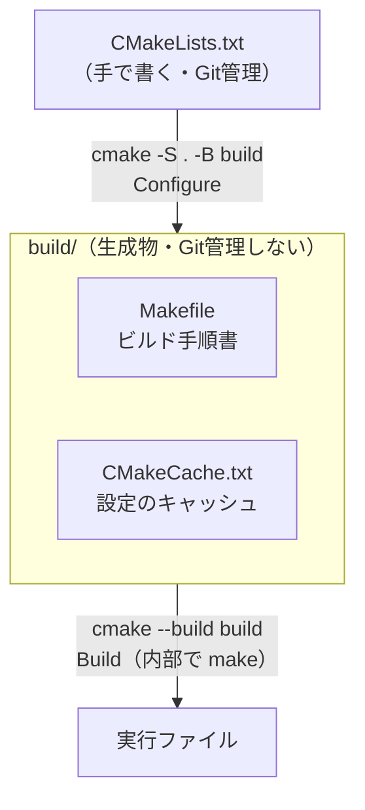
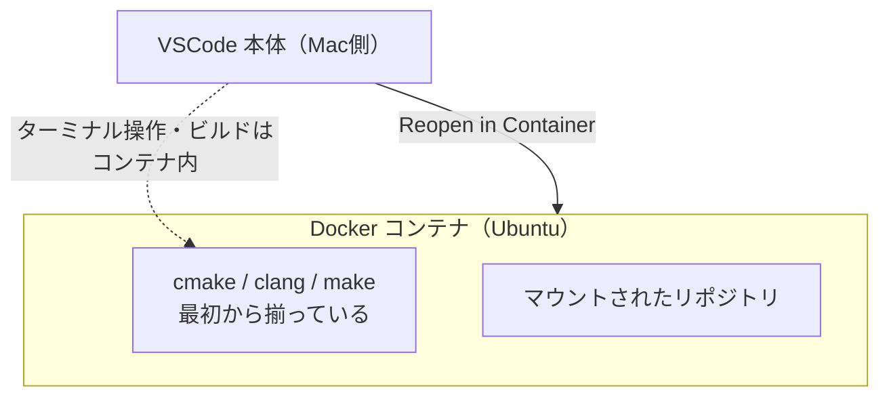

# 解説：ビルドシステムと開発環境

このドキュメントは「なぜこうしているのか」を扱う。手順は How-to を、正確な値は
Reference を参照。

## なぜ CMake を使うのか

C++ のビルド方法には段階がある。

- **手動 `clang++`**：ファイルが1〜2個なら十分だが、増えると毎回全ファイルを書き並べる必要があり破綻する。
- **Makefile**：差分ビルドはできるが、OS・コンパイラごとに書き方が変わり管理が煩雑。
- **CMake**：`CMakeLists.txt` という1つの記述から、各環境向けの Makefile（や Ninja ファイル）を**生成**する。クロスプラットフォームで動く。

このリポジトリは練習用だが、ファイルが複数に分かれる設計練習をするため CMake を採用している。1ファイルだけの実験なら直接コンパイル（How-to 参照）でも十分。

## ビルドの仕組み — Configure と Build の2段階

CMake のビルドは2段階に分かれている。この分離を理解すると、エラーの切り分けが楽になる。

- **Configure（`cmake -S . -B build`）**：`CMakeLists.txt` を読み、使うコンパイラやC++規格を決定し、`build/` に `Makefile` と `CMakeCache.txt` を生成する。
- **Build（`cmake --build build`）**：生成された `Makefile` を `make` に渡し、`clang++` を呼んで `.cpp` → `.o` → 実行ファイルへ変換する。

「真の設定」は手書きする `CMakeLists.txt` だけで、`Makefile` や `CMakeCache.txt`
はそこから自動生成された派生物に過ぎない。だから `build/` はいつ消してもよく、
`.gitignore` で除外している。

### CMakeCache.txt のはまりどころ

`CMakeCache.txt` は設定をキャッシュするため、`CMakeLists.txt` を後から変更しても
（例：C++20→C++23）古いキャッシュが残って反映されないことがある。確実なリセットは
`rm -rf build` してから再 Configure する方法。

## なぜプロジェクトを `projects/` 配下に独立させるのか

このリポジトリは「試したいテーマごとに完全に独立したプロジェクトを置く」方針で設計している。

- 各テーマは自己完結し、互いに干渉しない。あるテーマのビルドが壊れても他に波及しない。
- トップレベルの `CMakeLists.txt` に `add_subdirectory(projects/<theme>)` を1行足すだけでテーマを増やせる。
- 将来テーマ間で共通コードを使いたくなったら、`add_subdirectory` で共通ライブラリを取り込む拡張余地もある（最初は不要）。

練習用リポジトリとして「1テーマ＝1独立プロジェクト」が一番見通しが良い、という判断。

## Dev Container の仕組みと利点

Dev Container は、開発環境そのものを Docker コンテナの中に閉じ込める仕組み。

ポイントは、**エディタ（VSCode）は Mac で動き、コンパイルなどの実行はコンテナ（Ubuntu）の中で行われる**という分離。

利点：

- **環境構築が不要**：コンテナ内に cmake などが最初から入っている。Mac 側に何も入れなくてよい。
- **再現性**：`Dockerfile` に環境が書いてあるので、別のPC・他人・将来でも全く同じ環境になる。「自分の環境では動く」問題が起きにくい。
- **Mac を汚さない**：ツールを本体にインストールしない。
- **OS差の吸収**：本番が Linux でも Mac 上で Linux 環境を再現できる。

トレードオフ：

- 相手にも Docker が必要。
- 依存ゼロの練習段階では恩恵が小さい。外部ライブラリを使い始めると価値が一気に上がる。

このリポジトリでは Dev Container は**必須ではなく選択肢の1つ**。ローカルに直接環境を
作る道（How-to の方法1・2）と併存している。他人と共有する／複数マシンで作業する／
外部ライブラリを使い始める段階で効いてくる。

## なぜ clang-format / Dev Container を残しているか

過去に `CMakePresets.json` と `.editorconfig` は「シンプル化」のため削除した。一方で
以下は残している：

- **`.clang-format` + `.vscode/settings.json`**：セットで「保存時の自動整形」を実現する。練習中もコードが整って学習しやすい。
- **`.devcontainer/`**：将来の共有・ライブラリ導入を見越した再現環境。設定ファイルは軽量なので残すコストが小さい。

「今すぐ使わなくても、将来の価値と維持コストの釣り合いで残す」という判断。
