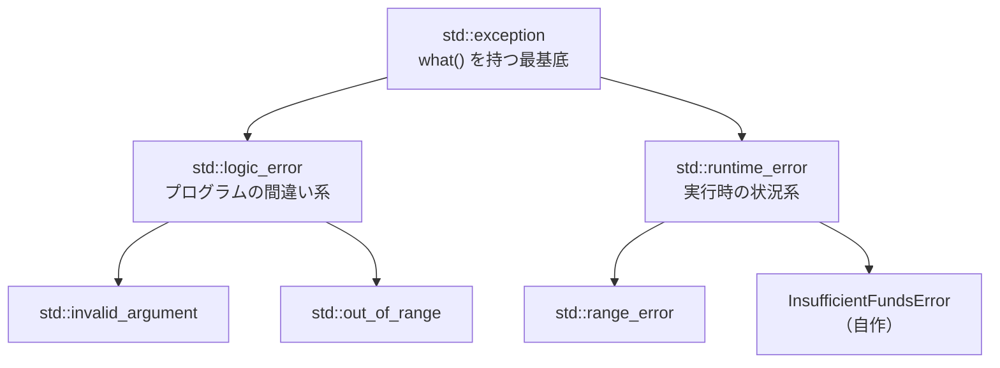

# 解説：例外処理の設計

[try_catch プロジェクト](../../projects/try_catch/) で学んだ、C++の例外処理の考え方をまとめる。
コードの手順ではなく「なぜそうなっているか」を扱う。

## C++に「例外クラス」という特別な型は無い

C++では **どんな型でも `throw` できる**。Javaのような「例外専用クラスを継承しないと
投げられない」という縛りは無い。

```cpp
throw 42;                    // int
throw std::string("error");  // string
struct MyError { int code; };
throw MyError{404};          // 何も継承していない struct でも投げられる
```

つまり、あるクラスが「例外」になるのは **そのクラスが何であるか** ではなく、
**throw / catch されるという使われ方をするか** で決まる。同じクラスを普通の
オブジェクトとしても例外としても使える。**言語レベルでは例外クラスと普通のクラスは
区別がつかない**。

では何で区別するかというと **命名と継承という慣習**：

- 名前の接尾辞 `Error` / `Exception`（例 `InsufficientFundsError`）
- `std::exception` 系を継承している（例 `: public std::runtime_error`）

これらは言語の強制ではなく、「これは例外として使う設計です」という人間向けのサイン。

## 標準例外の階層



- **`std::exception`** … 最基底。`what()`（メッセージを返す仮想関数）を持つ。
- **`std::logic_error`** … 事前に防げるはずのプログラムの誤り（不正な引数、範囲外）。
- **`std::runtime_error`** … 実行時の状況で起こる、事前に防げないエラー。

`logic_error` も `runtime_error` も**どちらも `what()` とメッセージ保持の仕組みを持つ**
（両方 `std::exception` 由来）。違うのは**意味だけ**。だからカスタム例外は「機能」では
なく「意味」で継承先を選ぶ。「残高不足」は実行時の口座状態に依存するので
`runtime_error` を選んだ。

## なぜ std::exception 系を継承するのか

継承は**必須ではない**（継承ゼロの自前 struct でも例外にできる）。それでも継承するのは、
エコシステムと協調するため：

| | 継承なし（自前 struct） | `std::runtime_error` を継承 |
|---|---------------------|---------------------------|
| `catch (const std::exception&)` で捕まる | ❌ | ✅ |
| `what()` | ❌ 自前実装が必要 | ✅ 受け継ぐ |
| 標準ライブラリ・他人のコードとの相性 | ❌ | ✅ |

`std::runtime_error` を継承すると、メッセージ保持と `what()` が**無料で手に入り**、
`catch (const std::exception&)` の一括 catch にも引っかかる。なお、基底クラスで catch
できるのは **public 継承** だから（`: public std::runtime_error`）。

## カスタム例外は構造化データを載せられる

標準例外は `what()` の文字列しか持たないが、カスタム例外は**追加の構造化データ**を
持てる。これがカスタム例外を作る価値。

```cpp
class InsufficientFundsError : public std::runtime_error {
public:
  [[nodiscard]] int balance() const { return balance_; }     // 残高
  [[nodiscard]] int requested() const { return requested_; } // 要求額
private:
  int balance_;
  int requested_;
};
```

呼び出し側は、文字列を解析せずに**数値で判断・再計算**できる。

```cpp
catch (const InsufficientFundsError& e) {
  int shortfall = e.requested() - e.balance();  // 不足額を計算
}
```

## what() は仮想 → 基底で受けても実体のメッセージが返る

`what()` は**仮想関数**なので、基底クラスの参照 `const std::exception&` で受けても、
`e.what()` は**実体（本物のオブジェクト）の `what()`** を呼ぶ（ポリモーフィズム）。

```cpp
catch (const std::exception& e) {   // 受け口は基底
  std::cerr << e.what();            // 実体が InsufficientFundsError なら、そのメッセージが返る
}
```

つまり基底で一括 catch しても、各例外の正しいメッセージが出る。これは「あらゆる例外を
1か所で受けつつ、各々のメッセージを出す」ための設計。

### ただし参照で受けること（スライシング）

| 受け方 | 何が起きるか | カスタムメッセージ |
|--------|------------|-----------------|
| `const std::exception& e`（参照） | 実体をそのまま参照 → 仮想ディスパッチが効く | ✅ 返る |
| `std::exception e`（値） | **スライシング**：派生部分が切り落とされる | ❌ 失われる |

値で受けると派生クラスの部分が切り捨てられてコピーされる（**オブジェクト
スライシング**）。だから**例外は必ず参照（`&`）で受ける**。これが「例外は参照で受ける」
鉄則の核心。

## catch の順序：狭い → 広い

catch は**書いた順に上から試され、最初に合致したものが使われる**。だから広いものを後に置く。

```cpp
catch (const InsufficientFundsError& e) { ... }  // 狭い（特定の型）
catch (const std::exception& e)         { ... }  // 中間（std例外全般）
catch (...)                             { ... }  // 最も広い → 必ず最後
```

`catch (...)` は**型を問わず全例外を捕まえる**最後の砦。`std::exception` を継承しない
例外（`int`、文字列、無関係な型）も拾えるが、**例外オブジェクトにアクセスできない**
（`e.what()` が使えない）。広いものを先に書くと、後ろの具体的な catch に届かない。

## 再スロー（throw;）

`catch` すると例外はそこで**消費され、伝播が止まる**。`catch` の中で
オペランドなしの **`throw;`** を書くと、**今捕まえている例外をそのまま投げ直し**、
伝播を再開してさらに上位へ渡せる。

```cpp
catch (...) {
  // 後始末など local な処理をして…
  throw;   // 例外自体は上位に任せる（自分では握りつぶさない）
}
```

用途：

- **後始末してから上に任せる**：後始末の責任だけ持ち、エラーの判断は上位ハンドラに委ねる。
- **`catch (...)` で正体不明を握りつぶさない**：型が分からないものを「処理済み」に
  してしまうとバグを隠す。後始末だけして `throw;` で上へ流す。

### `throw;`（裸）と `throw e;` は違う

| 書き方 | 何が起きるか |
|--------|------------|
| `throw;`（裸） | 捕まえた**元のオブジェクトをそのまま**投げ直す（型・メッセージ保持） |
| `throw e;` | `e` の**コピー**を投げる。基底参照で受けていると**スライシング**で派生情報が消える |

再スローは**必ず裸の `throw;`** を使う。

### 最終ハンドラは再スローしない

`throw;` は「上位に任せる」ためのもの。**main のような最終ハンドラは伝播の終点**で、
投げ直す相手がいない（投げ直すと `std::terminate` に至る）ため、`throw;` せず処理を
完結させる。

| catch の位置 | `throw;` すべきか |
|------------|----------------|
| 途中（後始末だけしたい） | する（処理は上位に任せる） |
| 最上位（main 等の最終ハンドラ） | しない（ここで完結させる） |

> 補足：「後始末してから `throw;`」は、**RAII**（デストラクタで自動後始末）を使うと
> try/catch なしで自動化できる。RAII はモダンC++の例外安全の核。

## main の安全網

すべての `main` は最外 try/catch で囲み、`std::bad_alloc` のように throw を書かなくても
起こりうる例外から守る。詳細は
[reference の「main は最外 try/catch を持つ」](../reference/cmake-and-structure.md) を参照。
ただし C++ 例外への安全網であって、未定義動作やシグナル（セグフォルト等）は捕まえられない。

## まとめ

- C++に「例外クラス」という型は無い。例外かどうかは**使われ方**で決まる
- `std::exception` 系の継承は必須ではないが、**一括 catch・`what()`・協調**のための定石
- `logic_error` / `runtime_error` は**意味で選ぶ**（機能は同じ）
- カスタム例外は**構造化データ**を載せられる（カスタム例外の価値）
- `what()` は仮想 → **参照で受ければ**実体のメッセージが返る（値だとスライシングで消える）
- catch は**狭い → 広い**の順。`catch (...)` は最後
