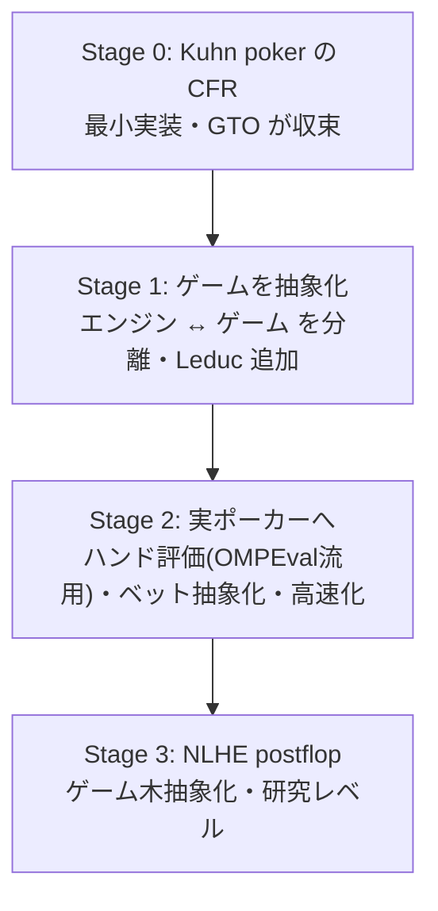

# cfr — CFR による GTO ソルバー（自作）

不完全情報ゲームのナッシュ均衡（＝GTO 戦略）を **CFR（Counterfactual Regret
Minimization）** で計算する、自作の C++ ライブラリ。**Kuhn poker** から始め、段階的に
育てる学習プロジェクト。

このドキュメントはプロジェクト内に同梱している（リポジトリルートの `docs/` とは別）。
プロジェクトを別リポジトリへ引っ越しても、フォルダごと持ち出せるようにするため。

## ドキュメント

| 文書 | 内容 |
|------|------|
| [background.md](background.md) | なぜ CFR ソルバーを自作するのか。ポーカー計算ライブラリの全体像と調査結果 |
| [kuhn-poker.md](kuhn-poker.md) | Kuhn poker のルール・情報集合・GTO |
| [leduc-poker.md](leduc-poker.md) | Leduc poker のルール（公開カード・2ラウンド）と Kuhn から増える要素 |
| [cfr.md](cfr.md) | CFR アルゴリズムの解説（実装する部品まで） |
| [flowchart.md](flowchart.md) | 実装の処理フロー図（呼び出し構造・cfr() の核心・ゲーム木）。理解／リファクタ用 |

## 設計方針：エンジンとゲームを分離する

```
cfr ライブラリ
├── CFR エンジン（ゲーム非依存：どんなゲームでも解ける）
└── games/
    ├── kuhn          ← 最初の応用
    ├── leduc         ← 後で追加
    └── （いずれ poker）
```

`std::sort` が「比較関数」を受け取って任意の型をソートできるのと同じ発想で、
CFR エンジンは「ゲームの定義」を受け取って任意のゲームを解く。この分離が
ライブラリ設計の核心。

## ロードマップ



| 段階 | 作るもの | 学ぶこと | 状態 |
|------|---------|---------|------|
| **0** | Kuhn poker の CFR（最小） | CFR の原理、ライブラリの基本構造 | ✅ 完了（−1/18 に収束。[cfr.md](cfr.md) 参照） |
| **1** | エンジンとゲームの分離（抽象化） | ライブラリ設計の核心 | ✅ 完了（`CfrSolver<G>` ↔ `Game` concept。[flowchart.md](flowchart.md) 参照） |
| **2** | 実ポーカー化（評価・抽象化・高速化） | 車輪の再発明回避・性能 | |
| **3** | NLHE postflop | 研究レベル。TexasSolver のソースが教材 | |

Stage 0〜1 で「自作 CFR ライブラリ」と呼べるものになる。
