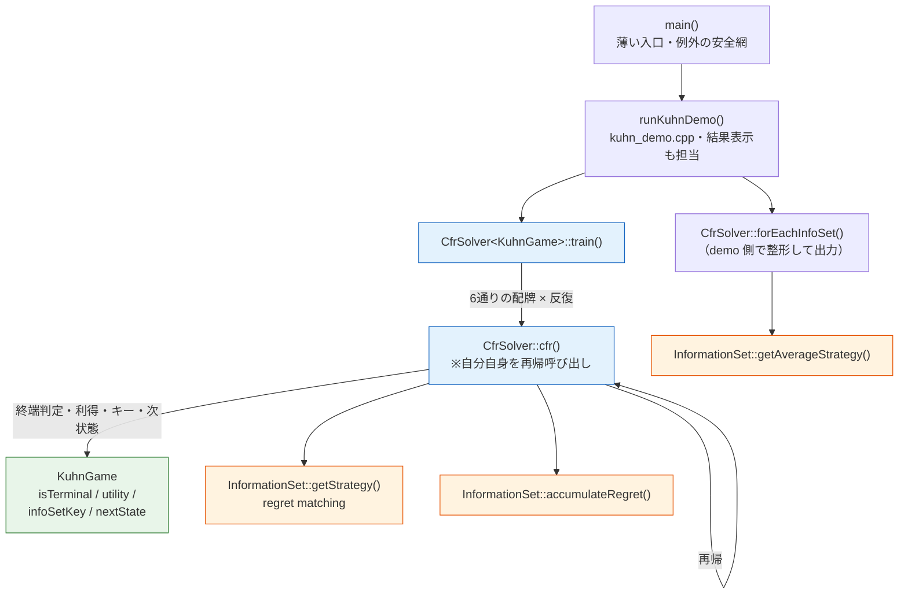
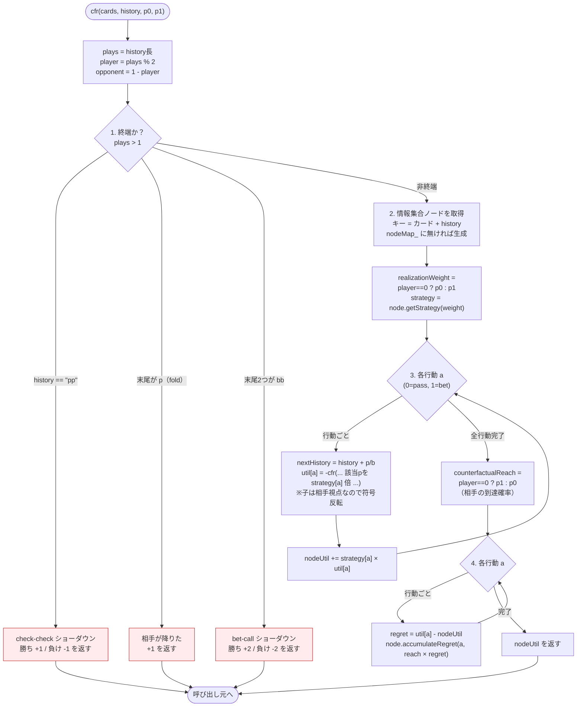
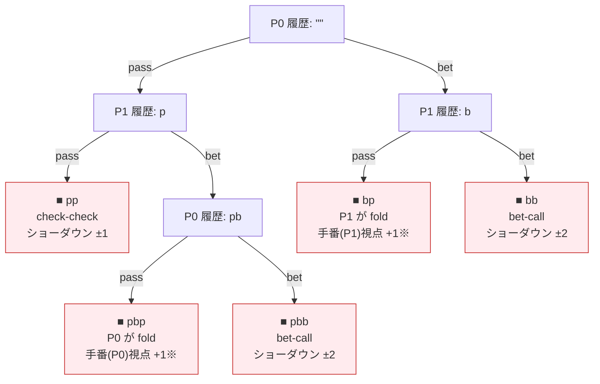
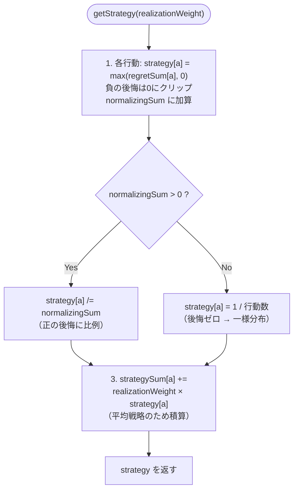
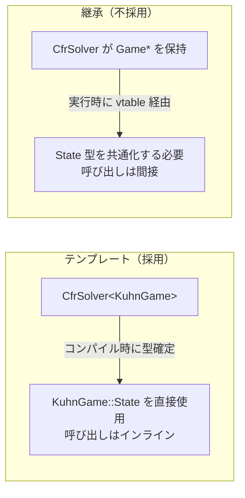

# CFR 実装フローチャート

実装を図で俯瞰する。Stage 1（エンジンとゲームの分離）後の構成に対応。
中心は [`cfr_solver.h`](../include/cfr_solver.h)（ゲーム非依存エンジン）と
[`kuhn_game.cpp`](../src/games/kuhn_game.cpp)（Kuhn のルール定義）。

アルゴリズムの考え方は [cfr.md](cfr.md)、ゲームのルールは [kuhn-poker.md](kuhn-poker.md) を参照。

## 1. 全体の呼び出し構造

入口 `main` から末端の regret matching まで。誰が誰を呼ぶか。



- 青 = CFR エンジン（`CfrSolver<G>`：ゲーム非依存）/ 緑 = ゲーム定義（`KuhnGame`）/ 橙 = 情報集合の部品（`InformationSet<N>`）。
- `CfrSolver` は Kuhn を一切知らない。終端・利得・行動・キーはすべて `KuhnGame`（`Game` concept）へ問い合わせる。`std::sort` が比較関数に委ねるのと同じ構図。

## 2. train() のループ構造

```mermaid
flowchart TD
    start(["train(iterations)"]) --> init["utilSum = 0"]
    init --> iloop{"i < iterations ?"}
    iloop -->|No| ret["平均ゲーム価値を返す<br/>utilSum / (iterations × 6)"]
    iloop -->|Yes| dloop{"6通りの配牌<br/>DEALS を順に"}
    dloop -->|次の配牌| call["utilSum += cfr(cards, &quot;&quot;, 1.0, 1.0)<br/>履歴は空・到達確率は両者1.0"]
    call --> dloop
    dloop -->|6通り完了| inext["++i"]
    inext --> iloop
    ret --> done(["終了"])
```

- `DEALS` は 3 枚から 2 人へ配る全 6 通りを全列挙する（chance node を sampling せず総当りする **vanilla CFR**）。
- 1 反復＝6 配牌ぶんゲーム木を辿る。だから平均の分母が `iterations × 6`。

## 3. cfr() の処理フロー（核心）

`cfr()` は 1 つの情報集合（手番プレイヤーの視点）を処理して、その期待利得を返す再帰関数。
コード中の番号コメント `1.〜4.` に対応する。



### 符号反転 `-cfr(...)` の意味

`cfr()` は常に「**今の手番プレイヤー視点**」の利得を返す。子ノードは相手の手番なので、
親から見ると損得が逆。だから `util[a] = -cfr(...)` で反転して自分視点に揃える。

### 到達確率 p0 / p1 の役割（2種類の使い分け）

| 用途 | 使う確率 | 意味 |
|------|----------|------|
| 戦略の積算（getStrategy の重み） | **自分**の到達確率 | 平均戦略を「来やすい所ほど濃く」する |
| regret の重み（counterfactualReach） | **相手**の到達確率 | 反実仮想：自分がここに来る確率は外す |

この「自分／相手のどちらの確率か」が CFR の肝（[cfr.md](cfr.md) の ③counterfactual）。

## 4. Kuhn poker のゲーム木（cfr が辿る空間）

`cfr()` が history を伸ばしながら辿る木。葉（■）が終端利得。
`P0`/`P1` は手番、利得は**そのノードの手番プレイヤー視点**。



- ※ fold 系の `+1` は「直前に降りた相手からポットを取る＝手番プレイヤーの勝ち」。実装では
  `terminalPass` かつ `history != "pp"` の枝（コードの `return 1.0;`）。
- 情報集合キーは「自分のカード＋history」。例：J(0) を持って `pb` の局面なら `0pb`。
  相手のカードは見えないので、相手札だけ違う複数の実状態が 1 つの情報集合に潰れる。

## 5. regret matching：getStrategy()

各情報集合が「後悔の大きい行動ほど高確率」で次の戦略を作る部分。



- 返す `strategy` は **この反復の戦略**。これは均衡に収束しない。
- 収束するのは `strategySum_` を正規化した **平均戦略**（[`getAverageStrategy()`](../include/information_set.h)。`forEachInfoSet` で取り出し、`kuhn_demo` 側が整形して出力）。これが CFR 最大の落とし穴（[cfr.md](cfr.md) の ④）。

## Stage 1 達成：エンジンとゲームの分離

かつて `KuhnTrainer::cfr()` に直書きされていたゲーム固有の知識を、`Game` concept
（[`game.h`](../include/game.h)）を満たす [`KuhnGame`](../include/games/kuhn_game.h) へ
逃がした。境界は以下の通り。

| 元の場所（KuhnTrainer） | 移動先 | 種別 |
|------|--------|------|
| 終端判定（`pp` / 末尾 `p` / 末尾 `bb`） | `KuhnGame::isTerminal` | ゲーム固有 |
| 利得（±1, +1, ±2） | `KuhnGame::utility` | ゲーム固有 |
| 行動の文字 `p` / `b` と次状態 | `KuhnGame::nextState` / `NUM_ACTIONS` | ゲーム固有 |
| 情報集合キー（`カード + history`） | `KuhnGame::infoSetKey` | ゲーム固有 |
| 配牌6通りの列挙 | `KuhnGame::initialStates` | ゲーム固有 |
| `cfr` 再帰・到達確率・regret 積算 | `CfrSolver<G>` | **ゲーム非依存** |

`CfrSolver` は「終端か？／利得は？／次状態は？／キーは？」を `Game` に問い合わせるだけ。
別ゲーム（Leduc など）を追加するときは `Game` concept を満たす新クラスを書いて
`CfrSolver<LeducGame>` とするだけでよい。これが [README](README.md) の設計方針の実体。

## なぜ継承でなくテンプレートか

エンジンとゲームを繋ぐ方法は2流派ある。**継承＋仮想関数（実行時ポリモーフィズム）**と
**テンプレート＋concept（コンパイル時ポリモーフィズム）**。本実装は後者を選んだ。



選定理由（①が決定的）：

| 観点 | テンプレート | 継承＋virtual |
|------|------------|--------------|
| **① State 型がゲームごとに違う** | ◎ `KuhnGame::State` をそのまま使える | ✗ 基底が各 State を知らず共通化が要る（型消去/キャスト地獄）|
| **② 速度**（CFR は再帰で数百万回） | ◎ インライン展開・ゼロ overhead | △ vtable 経由の間接呼び出し |
| ③ 実行時の型差し替え | ✗ できない（`<KuhnGame>` を書き切る）| ◎ `vector<Game*>` で混在可 |
| ④ コンパイル時間・バイナリ | △ 型ごとに膨張 | ◎ 実装1つ |
| ⑤ 契約の明示 | concept で補う | 純粋仮想関数で自然に明示 |

①が肝。`KuhnGame::State = {cards, history}` と `LeducGame::State = {cards, board, ...}` は
別の型で、継承では `virtual bool isTerminal(??? state)` の `???` に書く共通型が無い。
テンプレートなら各ゲームが自分の `State` を持ち込み、コンパイラがそのゲーム専用の
ソルバーを焼くので問題が消える。`std::sort` が比較関数を基底クラス無しで受け取れるのと同じ。

⑤の弱点（テンプレートは素だと契約が不明瞭）は `template <Game G>` の
[`Game` concept](../include/game.h) で補っている。concept が「isTerminal/utility/… を持つこと」を
コンパイル時に強制し、継承の長所（契約の明示）をテンプレートに取り込んでいる。

> 逆に「設定ファイルで解くゲームを実行時に選ぶ」「複数ゲームを1配列に混ぜる」設計なら
> 継承が正解だった。本実装はゲームをソースに書き切る前提なので、テンプレートの制約が
> 問題にならない。

### 副作用：テンプレートはヘッダオンリー

テンプレートは「使う型ごとにコンパイラが実体化する」ため、定義が使用箇所から見えて
いる必要がある。よって `CfrSolver<G>` と `InformationSet<N>` は実装もヘッダに置く
（`.cpp` に分離できない）。一方、テンプレートでない `KuhnGame` は通常どおり
`kuhn_game.h`（宣言）＋ `kuhn_game.cpp`（実装）に分離している。`std::vector` の実装が
`<vector>` ヘッダに入っているのと同じ事情。
